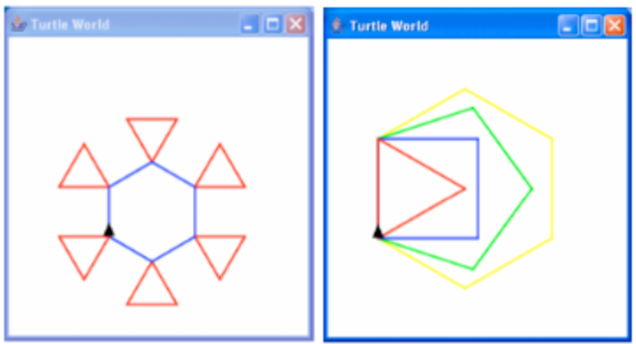

# Introduction to Programming

## Practical 1 
## Introducing BlueJ, Java and object modelling.

### Instructions

Download the example files you need for this practical from github. Do this by clicking on the "Clone in Desktop" or "Download ZIP" buttons on the right-hand side of the git page.

BlueJ is available on the ITS machines in the laboratories and you can also install it on your own machines by downloading it from 

<http://www.bluej.org>.

If you need help with it please see this tutorial to get you started:

<http://www.bluej.org/tutorial/tutorial-201.pdf>

### Level 1: Interacting with BlueJ

1. Using the _Picture_ example project in BlueJ, create an image of a house and a
sun. While you are doing this, write down what you have to do to achieve this.
Are there other ways this could be achieved? In order to do this you will have to compile the classes by clicking on the 'Compile' button.

    (BlueJ ex. 1.9) __Hint__: Start by creating instances of the Circle, Square and
Triangle by right clicking on each and selecting `new Circle()`. Do the same for
Canvas to show the drawing area, then for each of the red boxes representing
instances of the Circle, Square and Triangle object classes, right click on them
and select `void makeVisible()`. You will notice other actions (methods) you
can perform on the objects. Use these to move the objects around and change
their colours. (You can create multiple instances of each shape.)

2. Using the _Turtle_ project provided on DUO to draw your initials. While you are
doing this, write down what you have to do to achieve this. Are there other ways
this could be achieved?

    __Hint__: Start by creating an instance of Turtle and TurtleWorld (`new Turtle()`
and `new TurtleWorld()`). Use the `void display()` method in the instance
of TurtleWorld to show the drawing area, then use `void dropIn(Turtle t)`
to add the instance of the turtle you created to the TurtleWorld. Type in the name you gave to the Turtle created when ‘dropping’ it into the world. Then use methods from your Turtle object to move it around.

3. Using the _LabClass_	 example project in BlueJ, create an instance of a lab
class, entering a low number for the maximum students. Then create multiple
instances of the student class. Remember, when creating the instances of the
students, the name and ID are of the String data type so need to be enclosed in
double quotes, e.g. “Patricia”. Use the methods in the instance of the LabClass
you created to enrol the students created, filling in the other details for the lab
class, then print out the lab class details. Look at what happens when you try to
enrol more students than there is capacity for.
(BlueJ ex. 1.17-1.21) 

### Level 2: Starting to Program

1. Using the Picture example project in BlueJ again, create an instance of the
Picture class and draw it to look at the picture produced. Now open the object to
look at the code. The main ‘instructions’ for producing the picture are given in the
method starting public `void draw()`. The sun, roof, window and wall are
created at the top of the file. Extend this file changing some of the colours and
adding in ground with a tree.

    For a further challenge, try adding in a sunset as a separate method, (BlueJ
ex.1.14).

2. Using the Turtle project again, create an instance of the Picture Maker class.
Use the void display() and void drawInitials() methods to show
and draw two letters. Open the source code editor for the PictureMaker class to
look at the instructions used to draw the initials. Modify these instructions to draw
your own initials.

    For a further challenge try drawing some of the patterns in the pictures below:
    

3. Below is a method that can be added into the LabClass Class to automate the
setting up of a specific class with predefined students. Add this into your
LabClass and modify it to match the students that you added before. Try adding
something to change the capacity for the lab.

        public void autoLab() {
         setInstructor("Simon Smith");
         setRoom("AB123");
         setTime("Monday, 11am");
         Student s1 = new Student("Jo Bloggs", "S01234");
         Student s2 = new Student("John Smith", "S01235");
         enrollStudent(s1);
         enrollStudent(s2);
         printList();
        } 

### Level 3: Modelling Objects

We are starting to look at how to model objects, so here we would like you to
have a go at thinking about how to model some objects. Remember that objects
contain properties (fields), a way of constructing a new instance of this object
(usually how to set values to the properties defined) and actions (methods) that
the object can perform. Thinking about the various components of an object, we
would like to you model a pet using pen and paper, or in a simple text document,
or using Violet if you have it. When considering the different properties
associated with the object, think about what a suitable data type might be, for
example int, boolean, double, String, ...

Whilst considering the actions (methods), try to think about the instructions that
you would need to give in order to achieve the action and how it may effect some
of the properties of the pet, writing it out in words.

Some examples of different pets and associated actions and properties are given
below: Dog - Bark, walk, eat, sleep, play (name, age, alive, health) Fish - bob,
swim, eat Snake - Hiss, eat, shed skin!